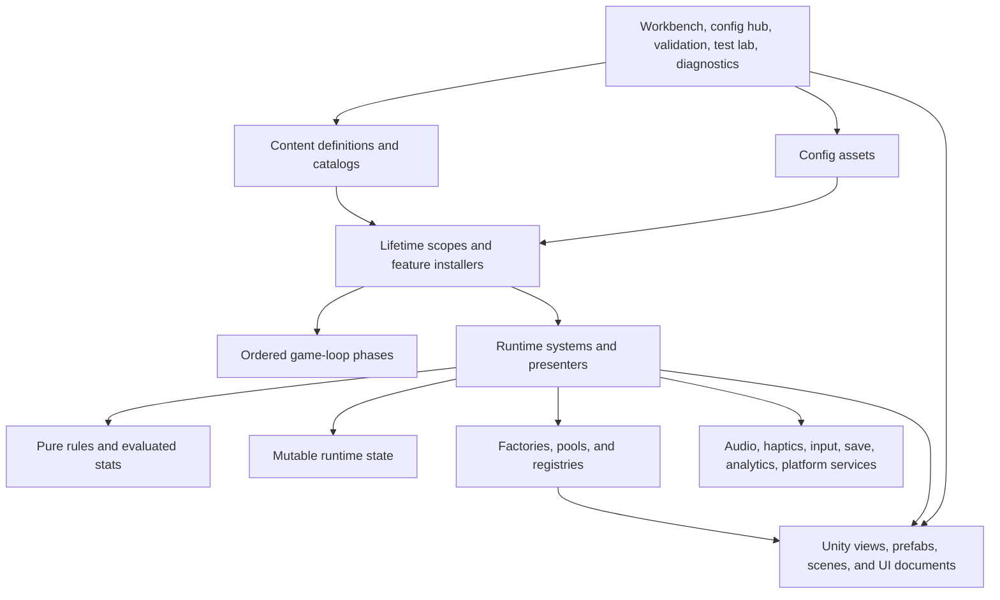
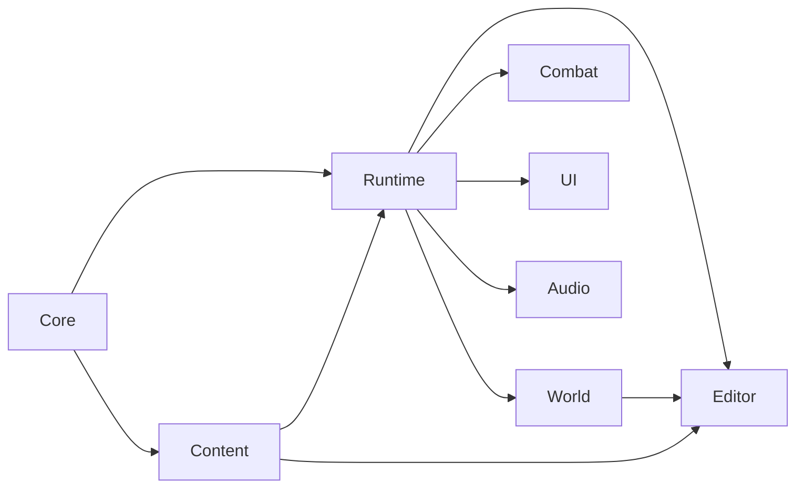

# Reusable Unity Project Architecture Blueprint

Status: Current Reference
Audience: Developers, technical designers, and teams starting a new Unity game

This document consolidates the strongest reusable patterns found in **The Circussy One** and turns them into a generic starting architecture for another Unity project. It is intentionally standalone: copy this file into a new project's `docs/` folder, replace `[GameName]`, `[GameNamespace]`, and feature examples, then implement the project in the order described here.

The goal is to copy the **architecture, ownership rules, authoring workflow, and verification discipline**—not the game's circus-specific content or paid third-party assets.

---

## 1. What Was Studied

The source project uses Unity `6000.3.6f1`, URP `17.3.0`, the Input System, UI Toolkit, VContainer, UniTask, Animancer, PrimeTween, Odin Inspector, Shapes, More Mountains Feel, Wwise, and a substantial project-owned editor toolset.

The analysis cross-checked:

- 90 documentation artifacts;
- 401 project-owned runtime C# files;
- 51 project-owned editor C# files;
- 149 EditMode test files and 3 PlayMode smoke-test files;
- separate runtime, editor, test, and visual-test assemblies;
- Boot, Main Menu, and gameplay scenes in Build Settings;
- content definitions, catalogs, configs, runtime systems, rules, factories, registries, views, DI wiring, UI Toolkit layouts, audio/haptics boundaries, world generation, and editor authoring tools.

The resulting blueprint separates three things:

1. **Keep:** patterns that are already strong and transferable.
2. **Adapt:** patterns that depend on the next game's genre or team.
3. **Improve:** patterns that should be introduced earlier or split more aggressively next time.

---

## 2. Executive Summary

Use this architecture when the game has many tuneable content pieces, repeated runtime entities, designer-owned data, and systems that benefit from deterministic testing.

The core model is:

- **Definitions** describe individual pieces of content.
- **Catalogs** define which content is available to runtime selection.
- **Configs** describe global tuning and presentation settings.
- **Runtime state** stores mutable state for the current session/run.
- **Rules** perform deterministic math and decisions.
- **Systems** coordinate runtime behavior.
- **Factories** own creation, pooling, activation, and despawning.
- **Registries** expose active runtime collections.
- **Views** own Unity objects and presentation.
- **Services** isolate external or cross-cutting capabilities.
- **Presenters** translate runtime state/events into UI, audio, haptics, or visuals.
- **Lifetime scopes/installers** compose the application.
- **Editor tools** make the architecture usable by designers and maintainable by developers.

The most important workflow rule is:

> Treat authored data, runtime behavior, projected/generated visuals, and structural scene generation as different kinds of work.

Do not rebuild scenes for ordinary tuning. Do not put gameplay rules in MonoBehaviours. Do not let external plugins leak across the codebase. Do not claim a visual feature is correct because unit tests pass.

---

## 3. Architecture Map



The runtime dependency direction should generally point downward in that diagram. Rules and state must not depend on UI or editor code. Project gameplay code should not call vendor APIs directly unless it is the dedicated adapter for that vendor.

---

## 4. Non-Negotiable Design Principles

### 4.1 Config/content first

If designers will create or tune many instances of a concept, model it as data instead of expanding a global config or adding a switch statement.

Examples:

- `WeaponDefinition` + `WeaponCatalog`
- `EnemyDefinition` + `EnemyCatalog`
- `CharacterDefinition` + `CharacterCatalog`
- `ItemDefinition` + `ItemCatalog`
- `EncounterDefinition` + `EncounterCatalog`

Use a focused global config only for rules that truly apply across the whole game, such as progression curves, global difficulty, camera behavior, or world-generation policy.

### 4.2 Thin Unity views

A `*View` may own:

- transforms, renderers, colliders, animators, particles, audio emitters, and UI elements;
- local visual state;
- material property blocks;
- visual-only animation and effect hooks;
- read-only Unity references required by a system.

A view should not decide:

- damage or XP formulas;
- targeting and eligibility;
- reward selection;
- spawn policy;
- progression;
- inventory rules;
- run-state transitions.

### 4.3 Plain-C# rules

Put math and decisions into `*Rules` types without scene dependencies. Prefer static functions or small immutable services.

Rules are appropriate for:

- stat stacking;
- progression curves;
- cooldown calculations;
- target ranking;
- content eligibility;
- weighted selection;
- state-transition validation;
- deterministic placement planning;
- UI display formatting that does not require a visual tree.

### 4.4 Runtime entities are not MonoBehaviours

Represent mutable gameplay entities with plain runtime objects when practical. They may hold a reference to their Unity view, but gameplay state stays outside the view.

```csharp
public sealed class EnemyRuntime
{
    public EnemyRuntime(EnemyDefinition definition, EnemyView view, int maxHealth)
    {
        Definition = definition;
        View = view;
        MaxHealth = Math.Max(1, maxHealth);
        CurrentHealth = MaxHealth;
    }

    public EnemyDefinition Definition { get; }
    public EnemyView View { get; }
    public int MaxHealth { get; }
    public int CurrentHealth { get; private set; }
    public bool IsDead => CurrentHealth <= 0;
}
```

Copy spawn-time values into runtime state when live instances should not mutate under a designer's mid-session asset edit.

### 4.5 Creation belongs to factories

Runtime systems should not scatter `Instantiate` and `Destroy` calls. A factory owns:

- prefab selection;
- pooling;
- construction of runtime state;
- registration;
- activation/deactivation;
- prewarming;
- despawn cleanup.

### 4.6 External dependencies stay behind project interfaces

Examples:

- `IGameAudio` hides Wwise or FMOD.
- `IGameHaptics` hides Input System motor calls.
- `IInputService` hides action maps and devices.
- `ISaveService` hides serialization/cloud storage.
- `IAnalytics` hides a vendor SDK.

This makes gameplay code stable, tests simpler, and vendor replacement possible.

### 4.7 Explicit startup and update order

Unity's implicit `Update` order is too weak for a system-heavy game. Compose an explicit order for startup, update, fixed update, and late update.

The source project manually supplies ordered `IStartable`, `ITickable`, `IFixedTickable`, and `ILateTickable` arrays to one `GameLoopRunner`. Preserve that clarity, but improve it with named phases or feature installers so one giant array does not become the only source of truth.

### 4.8 Diagnostics before speculative fixes

When a bug depends on physics contacts, loading stages, generated terrain, focus, middleware state, or timing, log the hidden decision data before changing rules.

Good diagnostic output includes:

- entity and system name;
- current state and requested transition;
- candidate inputs;
- chosen result and rejection reasons;
- positions, normals, distances, and classifications for physics;
- stage names and durations for loading;
- seed and attempt for generation;
- event/bank/RTPC state for middleware.

---

## 5. Recommended Folder Structure

```text
[ProjectRoot]/
├─ README.md
├─ .editorconfig
├─ .gitignore
├─ .gitattributes
├─ docs/
│  ├─ index.md
│  ├─ current-state.md
│  ├─ glossary.md
│  ├─ architecture/
│  ├─ authoring/
│  ├─ decisions/
│  ├─ workflow/
│  ├─ planning/
│  └─ history/
├─ Packages/
├─ ProjectSettings/
└─ Assets/
   ├─ Game/
   │  ├─ Art/
   │  │  ├─ Actors/
   │  │  ├─ Environment/
   │  │  ├─ Props/
   │  │  ├─ Shared/
   │  │  ├─ UI/
   │  │  └─ VFX/
   │  ├─ Audio/
   │  ├─ Editor/
   │  ├─ Fonts/
   │  ├─ Generated/
   │  ├─ Materials/
   │  ├─ Prefabs/
   │  ├─ Scenes/
   │  ├─ ScriptableObjects/
   │  │  ├─ Balance/
   │  │  ├─ Camera/
   │  │  ├─ Content/
   │  │  └─ Visuals/
   │  ├─ Scripts/
   │  │  └─ [GameNamespace]/
   │  │     ├─ Core/
   │  │     ├─ Content/
   │  │     ├─ Config/
   │  │     ├─ DI/
   │  │     ├─ Features/
   │  │     ├─ Rules/
   │  │     ├─ Runtime/
   │  │     ├─ Services/
   │  │     ├─ Stats/
   │  │     └─ Views/
   │  ├─ Tests/
   │  │  ├─ EditMode/
   │  │  └─ PlayMode/
   │  ├─ UI/
   │  │  ├─ Hud/
   │  │  ├─ Overlays/
   │  │  ├─ Settings/
   │  │  └─ Templates/
   │  └─ VisualTests/
   │     ├─ Editor/
   │     ├─ Runtime/
   │     ├─ Scenarios/
   │     └─ Scenes/
   ├─ Settings/
   ├─ StreamingAssets/
   └─ _ThirdParty/
```

### Folder ownership rules

- Project-owned assets live under `Assets/Game`.
- Vendor assets live under `Assets/_ThirdParty` or `Packages`.
- Project wrappers around vendor APIs live under `Assets/Game`.
- Canonical documentation lives outside `Assets` to avoid import and `.meta` churn.
- Manual art and generated outputs are separate.
- UXML/USS layouts are separate from imported UI art.
- Never put a one-off imported asset dump directly under `Assets/Game`.

### Naming rules

Use searchable suffixes:

- `*Definition`: one authored content item.
- `*Catalog`: available authored content set.
- `*Config`: broad tuneable behavior.
- `*VisualConfig`: tuneable presentation.
- `*Runtime`: mutable live entity state.
- `*Rules`: deterministic decisions/math.
- `*System`: runtime coordination.
- `*View`: Unity presentation/component bridge.
- `*Factory`: create/pool/despawn.
- `*Registry`: active runtime collection.
- `*Service`: external or cross-cutting capability.
- `*Presenter`: state/event-to-presentation bridge.
- `*Adapter`: narrow integration into a lifecycle or vendor boundary.
- `*Applier`: editor-time projection from config to assets/scenes.
- `*Repository`: editor/config asset lookup and canonical paths.
- `*Tests`: tests for the named type or behavior.

---

## 6. Assembly Definition Strategy

The source project correctly separates runtime, editor, EditMode tests, PlayMode tests, and visual tests. Preserve that baseline.

For a new project, start with:

```text
[GameName].Core
[GameName].Runtime
[GameName].Editor
[GameName].Tests.EditMode
[GameName].Tests.PlayMode
[GameName].VisualTests.Runtime
[GameName].VisualTests.Editor
```

When the project grows, split by stable dependency boundaries—not every folder:

```text
[GameName].Content
[GameName].World
[GameName].Combat
[GameName].UI
[GameName].Audio
```

Recommended direction:



Keep cycles impossible. Editor assemblies may reference runtime assemblies; runtime assemblies must not reference editor assemblies. Add an architecture test that rejects unguarded `UnityEditor` references in runtime source.

Do not split assemblies only to make the project look modular. Split when the dependency direction is clear and the compile-time/test isolation benefit is real.

---

## 7. Scene and Application Flow

Use three scene roles:

1. **Boot**: minimal first scene; initializes global/platform concerns and shows a transition before loading the menu.
2. **Main Menu**: hand-authored 3D backdrop, camera poses, UI document, selection/settings flow, and run-launch request.
3. **Gameplay**: gameplay lifetime scope, scene views, runtime roots, generated or authored world, HUD, and systems.

Example Build Settings order:

```text
0  Assets/Game/Scenes/Boot.unity
1  Assets/Game/Scenes/MainMenu.unity
2  Assets/Game/Scenes/Gameplay.unity
```

Rules:

- Boot and Main Menu are hand-authored scenes.
- Gameplay may contain generated structural roots, but day-to-day tuning must not require scene regeneration.
- Scene transition overlays should appear before starting expensive work.
- A selected character/loadout can cross scenes through a small pending-launch data object, not a large persistent gameplay singleton.
- Provide a direct-gameplay fallback for developer iteration, but verify the real Boot → Menu → Gameplay path.

---

## 8. Content Model

### 8.1 Definition contract

```csharp
public interface IContentDefinition
{
    string Id { get; }
    string DisplayName { get; }
}

public interface IActivatableContentDefinition : IContentDefinition
{
    bool IsActive { get; }
}
```

Use a normalized stable ID for save data, relationships, runtime lookup, analytics, and migrations. Do not use asset names or display names as identity.

Recommended ID rules:

- lowercase ASCII;
- begin with a letter;
- words separated by one underscore;
- no trailing underscore;
- never silently change an ID after shipping save data.

### 8.2 Catalog contract

```csharp
public interface IContentCatalog<out TDefinition>
    where TDefinition : class, IContentDefinition
{
    IReadOnlyList<TDefinition> Definitions { get; }
}
```

The catalog provides an explicit runtime allow-list. This supports the source project's useful three-state authoring model:

- **Available**: in catalog and active.
- **Disabled**: in catalog but inactive.
- **Draft**: asset exists but is not in the runtime catalog.

Drafting must never delete an asset.

### 8.3 Definition contents

A definition may include:

- identity and description;
- tags/classification;
- balance values;
- relationships to other definitions;
- rarity/selection metadata;
- spawn-time visual references;
- authoring validation;
- migration/default version fields.

If a definition becomes too broad, separate its sections into serializable profiles first. Move to multiple assets only when different disciplines truly need independent ownership.

### 8.4 Defaults and migrations

Use explicit versioned defaults for evolving ScriptableObjects. Never overwrite already-authored values merely because new defaults were introduced.

```csharp
[SerializeField, HideInInspector]
private int defaultsVersion;

public bool EnsureWorkflowDefaults()
{
    bool changed = false;
    if (defaultsVersion < 1)
    {
        // Initialize only fields introduced in version 1.
        defaultsVersion = 1;
        changed = true;
    }

    return changed;
}
```

### 8.5 Content validation

Validate:

- missing/invalid IDs;
- duplicate IDs;
- null catalog entries;
- invalid min/max relationships;
- references to draft/disabled content;
- impossible weights;
- missing required prefabs/icons;
- circular or incompatible relationships.

Put reusable validation rules in pure C# and expose them through both tests and editor tools.

---

## 9. Config Workflow Categories

Every tuneable asset must declare one of these categories in its inspector and documentation.

### Live Runtime

Read directly by runtime systems. No scene rebuild.

Examples:

- global balance;
- progression curves;
- camera feel;
- content definitions/catalogs;
- audio cue names/cooldowns;
- haptic patterns;
- procedural generation policy.

Some values may be copied at spawn or session start. State that clearly.

### Projected Visual

The config generates or updates an asset or open-scene presentation. Use a targeted `Apply` action.

Examples:

- generated materials/textures;
- shared VFX prefabs;
- UI panel scaling;
- lighting/volume settings;
- generated TMP materials;
- visual feedback prefabs.

The same applier must be used by the inspector button, Config Hub, and structural builder so they cannot drift.

### Structural Reset

Regenerates canonical scene/prefab topology. Use only for recovery or deliberate structural change.

Examples:

- missing runtime roots;
- DI scene references;
- generated prefab hierarchy;
- layers and physics setup;
- required UIDocument objects;
- canonical gameplay scene bootstrap.

Structural reset is a danger-zone action and must not overwrite hand-tuned configs or hand-authored menu layout.

---

## 10. Stats and Modifiers

Use stable, code-defined stat identity until designers genuinely need asset-defined stats.

Recommended pieces:

- `StatId`: stable enum identity.
- `StatDefinition`: metadata and stacking policy.
- `StatModifier`: stat, value, bucket, source.
- `RunStats`: mutable collection of active modifiers.
- `StatRules`: generic stacking formulas.
- domain rules such as `WeaponStatRules` for formulas that are not universal.

Do not use one universal percentage formula. Damage, cooldown, armor, count, range, luck, and XP often need different semantics.

Modifier sources should be explicit so UI/debug tools can explain the final value:

```text
Base value
+ character modifier
+ item modifier
+ talent modifier
+ temporary effect
= evaluated value
```

Provide breakdown APIs for debug UI, tooltips, tests, and balance inspection.

---

## 11. Dependency Injection and Composition

Use VContainer or an equivalent DI container at a small number of explicit composition roots.

The gameplay lifetime scope should group registrations by domain:

1. configs;
2. content catalogs;
3. scene views;
4. core state/services;
5. world services;
6. combat factories and registries;
7. feedback services;
8. systems/presenters;
9. game-loop order.

For a new project, prefer feature installers over one enormous registration file:

```csharp
public interface IFeatureInstaller
{
    void Install(IContainerBuilder builder, GameplaySceneReferences scene);
}
```

Possible installers:

```text
CoreFeatureInstaller
WorldFeatureInstaller
CombatFeatureInstaller
ProgressionFeatureInstaller
FeedbackFeatureInstaller
UiFeatureInstaller
```

### Constructor rules

- Required production dependencies should be non-null and fail fast.
- Avoid many optional constructor parameters in production services.
- Put test construction in a test builder/factory instead of widening the runtime API.
- If a DI type has multiple constructors, mark the runtime constructor explicitly with `[Inject]`.
- Add a regression test for critical constructor selection.

### Lifetime rules

- Use singleton lifetime only within the owning scope.
- Avoid static mutable gameplay state.
- Make disposal/reset behavior explicit for subscriptions, loops, tweens, motors, and middleware emitters.
- Keep scene references serialized at the scene composition boundary, not injected as one giant “everything” object into systems.

---

## 12. Ordered Game Loop

Use one runner to call systems in deliberate order.

Recommended phases:

```text
Input
RunState
Player
Spawning
AI
Interaction
Combat
Rewards/Pickups
Presentation
Cleanup
LatePresentation/Camera
```

Interfaces:

```csharp
public interface IStartable { void Start(); }
public interface ITickable { void Tick(); }
public interface IFixedTickable { void FixedTick(); }
public interface ILateTickable { void LateTick(); }
```

Pause handling should be centralized. Systems that must continue during pause implement an explicit marker such as `ITickableWhenPaused`.

Improve on the source pattern by composing phase-local lists from feature installers instead of maintaining one very large hard-coded array. Still produce a deterministic final order and test it.

---

## 13. Factories, Pools, and Registries

### Factory responsibilities

- select or receive a definition;
- acquire a pooled view or instantiate when necessary;
- apply the definition/presentation config;
- create runtime state;
- register the runtime entity;
- prewarm in bounded batches;
- unregister and return to pool on despawn.

### Registry responsibilities

- own active collections;
- provide read-only access;
- map views/colliders to runtime entities when needed;
- register/unregister explicitly;
- clean stale inactive entries defensively.

Avoid a universal registry that knows every game concept. A small actor registry may group tightly related high-frequency entities; other domains should use their own registries.

Prefer injected registries over static registries. Static scene registries are convenient for Unity components, but they risk stale state across domain reload settings, tests, and additive scenes.

### Pooling rules

- Pool high-frequency entities: enemies, projectiles, pickups, damage numbers, indicators, one-shot VFX.
- Do not pool everything by default.
- Prewarm during a visible loading stage.
- Suppress harmless completion warnings when pooled/destroyed visual targets disappear during scene transitions.

---

## 14. Systems and Presenters

A system coordinates a coherent runtime responsibility. It may consume rules, state, registries, factories, configs, services, and views.

Good system examples:

- movement;
- spawn director;
- targeting;
- projectile simulation;
- pickup attraction;
- interaction targeting;
- progression;
- run phases;
- world lifecycle;
- haptic sequencing.

A presenter observes runtime state/events and updates a presentation concern:

- HUD;
- announcements;
- damage vignette;
- audio cues;
- haptic cues;
- reward reveal;
- menu selection preview.

Do not create systems only to wrap one method. Create a seam when it isolates real ownership, ordering, lifecycle, or testability.

---

## 15. Shared Interaction Substrate

If the game has deliberate world interactions, define one common contract for targeting, prompts, hold progress, cancellation, and completion.

```csharp
public interface IInteractable
{
    bool IsInteractionAvailable { get; }
    int Priority { get; }
    Vector3 InteractionPosition { get; }
    string PromptText { get; }
    float HoldSeconds { get; }
    float Progress { get; }

    void SetInteractionTargeted(bool targeted);
    void BeginInteraction();
    void TickInteraction(float deltaTime);
    void CancelInteraction();
}
```

Target selection should:

1. collect candidates inside interact radius;
2. filter unavailable candidates;
3. rank by priority then distance;
4. lock the active target during a hold;
5. cancel consistently when range/input/state changes;
6. drive one shared prompt/outline language.

Keep pickup radius separate from deliberate interaction radius.

---

## 16. World/Level Lifecycle

Large level transitions should use a named, inspectable plan rather than a single monolithic load method.

Recommended stages:

```text
Clear current world
Generate/resolve world data
Publish world state
Refresh world-scoped visuals/collision
Spawn content
Prewarm pools/effects
Release gameplay
```

Use narrow adapter contracts:

```csharp
public interface IWorldRefreshAdapter
{
    string DiagnosticsName { get; }
    string LoadingStage { get; }
    UniTask RefreshAsync(WorldLoadDiagnostics diagnostics);
}

public interface IWorldSpawnAdapter
{
    string DiagnosticsName { get; }
    string LoadingStage { get; }
    UniTask SpawnAsync(int worldIndex, WorldLoadDiagnostics diagnostics);
}
```

Rules:

- Clear registries before generation so stale entities cannot leak.
- Name every stage in the loading UI and diagnostics.
- Yield between dense Unity main-thread batches.
- Move only pure computation off-thread; Unity object APIs stay on the main thread.
- Prewarm first-use objects during loading.
- Measure before optimizing.
- Keep a safe authored/prototype fallback when procedural generation fails.

For procedural worlds, separate:

1. deterministic request/seed;
2. pure generated data and masks;
3. validation/retry/fallback;
4. Unity mesh/collider realization;
5. gameplay placement services;
6. decoration/atmosphere;
7. traversal diagnostics.

Do not ask one generator to own design grammar, rendering, physics, rewards, bosses, navigation, and transitions.

---

## 17. UI Architecture

Use UI Toolkit for editable screen layout when it fits the project.

Recommended ownership:

- UXML owns hierarchy and named binding points.
- USS owns visual styling and states.
- templates own repeated component structure.
- views bind named elements and expose UI events.
- presenters/controllers bind runtime data and navigation.
- shared helpers own reusable effects, focus rules, and input-mode behavior.

Example structure:

```text
UI/
├─ MainMenu.uxml
├─ MainMenu.uss
├─ Hud.uxml
├─ Hud.uss
├─ Hud/
├─ Overlays/
├─ Settings/
└─ Templates/
```

Keep public element names stable. Treat them like a binding API.

Verify:

- keyboard/gamepad focus;
- mouse hover/click;
- submit/cancel behavior;
- modal input blocking;
- overlay ordering;
- input-mode switching;
- reduced-motion options;
- readability with real content lengths.

Do not construct the whole visual hierarchy in C# when designers should edit it in UI Builder. Runtime decoration may augment authored elements, but it should not replace layout ownership.

---

## 18. Audio, Haptics, and Feedback

### Audio

Gameplay posts semantic cues through `IGameAudio`:

```csharp
gameAudio.Play(GameAudioCue.PlayerDamaged, position);
```

The audio service owns:

- middleware event lookup;
- emitter lifecycle;
- one-shots and loops;
- cooldowns;
- bank/preload requests;
- RTPC/parameter updates;
- pause/reset/disposal cleanup.

The middleware project owns source audio, event authoring, randomization, mixing, response curves, and generated banks.

Treat middleware as a pipeline, not merely a C# library. Verify Unity wrappers, events, parameters, banks, generated files, and source-control state together.

### Haptics

Use `IGameHaptics` and named cues. A config owns pulse strength, duration, delay, priority, cooldown, and pause behavior. Never scatter raw motor values across gameplay code.

### General feedback

Keep feedback semantic and configurable:

- gameplay announces `DamageTaken`;
- presenters/services decide audio, haptic, camera, vignette, particle, and UI responses;
- frequent cues use cooldowns;
- reset/dispose stops long-running feedback.

---

## 19. Third-Party Package Strategy

The exact source project's package list is not a universal requirement. Use this decision table.

| Dependency | Role in source project | Recommendation for a new project |
| --- | --- | --- |
| URP | Rendering pipeline | Choose at project creation and lock version. |
| Input System | Keyboard/gamepad input and haptics | Recommended. Wrap it behind project input/haptics services. |
| VContainer | DI and lifetime scopes | Recommended for this architecture; Zenject or manual composition can substitute. |
| UniTask | Cooperative async Unity workflows | Recommended when staged loading/async systems are substantial. |
| Animancer | Animation playback/state | Optional. Use only with correct licenses; isolate animation ownership in views/drivers. |
| PrimeTween | UI/visual tweening | Optional. Keep tween calls in presentation code. |
| Odin Inspector | Designer-facing config authoring | Highly useful for this workflow, but paid/seat licensing matters. Plain custom inspectors can substitute. |
| Shapes | Runtime/editor visual primitives | Optional. Use for explicit debug/presentation primitives, not as a universal renderer. |
| Feel/MMFeedbacks | Feedback composition | Optional. Keep behind project feedback services. |
| Wwise | Runtime audio middleware | Optional and workflow-heavy. Use only if the audio team needs it. Keep behind `IGameAudio`. |
| Cinemachine | Camera tooling | Optional. The source project also uses project camera rules/views; do not add it without a clear owner. |
| ProBuilder | Blockout/editor geometry | Useful for level blockout and editable geometry. |
| Test Framework | EditMode/PlayMode tests | Required. |
| Code Coverage | Coverage reporting | Recommended as information first, gate later. |
| Unity MCP | Editor automation/inspection | Optional developer tooling, never a runtime dependency. |

Dependency rules:

- Pin package versions and Git revisions.
- Track `manifest.json` and `packages-lock.json` together.
- Maintain a license/dependency inventory.
- Do not copy paid Asset Store files into a new project unless every user has appropriate rights/seats.
- Keep project wrappers outside vendor folders.
- Do not edit vendor code unless the package is intentionally embedded/forked and the change is documented.
- Exclude unused demos/samples from the reusable starter repository where licensing and package structure allow it.

---

## 20. Editor Authoring Toolset

The source project's editor tooling is one of its strongest patterns. Recreate the roles, not necessarily the exact UI.

### Content Workbench

Designer-facing content browser/editor for:

- create from templates;
- duplicate;
- Available/Disabled/Draft status;
- safe deletion checks;
- catalog membership;
- relationship selection;
- ID generation/migration;
- validation summaries;
- icon/preview access.

It should be non-destructive by default.

### Config Hub

Developer/designer landing page for:

- core configs;
- projected visual applies;
- generated asset status;
- debug tools;
- diagnostics;
- structural reset danger zone.

### Authoring Doctor

Health scanner that reports before mutating:

- missing configs/catalogs;
- duplicate IDs;
- broken references;
- missing scene roots/components;
- generated asset drift;
- invalid content relationships;
- unexpected captures/local artifacts.

Safe actions must be explicit. Never silently rebuild scenes.

### Verification Dashboard

One green-gate panel for:

- last EditMode result;
- last PlayMode smoke result;
- coverage status;
- Authoring Doctor summary;
- console probe;
- source-control gate.

Store transient results under `Library/[GameName]/...`, not `Assets`.

### Visual Test Lab

Deterministic scenario scenes with:

- generated root;
- preserved `Manual Overrides` root;
- scenario asset;
- deterministic director;
- camera pose;
- timed events;
- capture times;
- expected state counts.

Also provide an exploratory Authoring Showroom for browsing visuals. The showroom is not a pass/fail test.

### Scene builder

Use only for structural bootstrap/recovery. It owns generated gameplay topology, generated prefab structure, layers/physics, and required DI references. It must not overwrite hand-authored menu scenes or tuneable configs.

---

## 21. Testing Strategy

### EditMode tests

Use for:

- pure rules;
- stat math;
- content validation and migrations;
- selection/eligibility;
- factories and pooling;
- deterministic generation data;
- editor workflow classification;
- targeted visual appliers;
- architecture guardrails.

### PlayMode tests

Use for a small number of high-value integration paths:

- Boot → Main Menu;
- Main Menu → selection → Gameplay;
- gameplay lifetime-scope construction;
- start/retry/reset;
- one generated/authored world smoke path;
- visual scenario director;
- pause/modal UI input blocking.

### Architecture tests

Add tests that reject:

- runtime references to editor assemblies;
- unguarded `UnityEditor` usage;
- direct instantiate/destroy in systems outside approved factories;
- missing `[Inject]` on critical multi-constructor DI types;
- scene builder owning config creation/path constants;
- missing required generated prefab components;
- duplicate content IDs;
- invalid dependency direction between feature assemblies.

### Visual verification

Tests cannot approve look and feel. Use:

- deterministic scenarios;
- fixed seeds;
- screenshots;
- actual controller checks;
- Game View/Play Mode review;
- clean idle console.

### Verification ladder

1. Unity import/compile.
2. Focused EditMode tests.
3. Full EditMode tests for shared infrastructure.
4. PlayMode smoke for startup/scene/DI changes.
5. Visual Test Lab or fixed-seed review for visible changes.
6. Authoring Doctor for content/asset health.
7. Final idle console with zero project errors/warnings.
8. Source-control diff and whitespace check.
9. Commit only the coherent verified change.

Add CI early. Run batchmode EditMode tests and at least one startup PlayMode smoke on the team's supported platform. Coverage should begin as a trend, not an arbitrary hard threshold.

---

## 22. Documentation System

Use plain searchable Markdown and one source of truth per concern.

Recommended pages:

```text
docs/index.md
docs/current-state.md
docs/glossary.md
docs/architecture/runtime-architecture.md
docs/architecture/dependency-boundaries.md
docs/architecture/assets-and-folders.md
docs/authoring/config-authoring.md
docs/authoring/scene-generation.md
docs/workflow/testing-and-verification.md
docs/workflow/dependency-onboarding.md
docs/workflow/git-and-commits.md
docs/decisions/ADR-0001-....md
docs/history/...-postmortem.md
```

Use status labels:

- `Current Reference`
- `Historical Reference`
- `Validation Recipe`
- `Parked Reference`

Add an ADR when a future developer will ask “why is it this way?” Include Problem, Decision, and Consequences.

Write postmortems for expensive invisible failures, especially generated-world traversal, loading hitches, middleware pipelines, save migration, and input/focus bugs.

Update docs in the same change when architecture boundaries, names, folders, authoring workflow, or verification policy changes.

---

## 23. Source Control and Reproducibility

Required root files:

```text
.git/
.gitignore
.gitattributes
.editorconfig
README.md
```

> Inspection note: the current working copy used for this review no longer contains `.git`, `.gitignore`, `.gitattributes`, `.editorconfig`, or `README.md`, although the project's own handbook expects them. They were likely omitted during a filesystem move. Restore them from the authoritative repository before treating this checkout as source-control complete.

Use Git LFS for binary art, audio, fonts, archives, and plugin binaries. Keep Unity YAML (`.unity`, `.prefab`, `.asset`, `.mat`, `.meta`) as normal text for review/merge.

Ignore at minimum:

```text
Library/
Temp/
Logs/
UserSettings/
CodeCoverage/
*.csproj
*.sln
generated captures
local screenshots
crash dumps
```

Do not move a Unity repository using a tool that omits hidden files. After a move, confirm `.git`, `.gitignore`, `.gitattributes`, `.editorconfig`, and `README.md` still exist.

On Windows, keep the physical project root short. Unity's bundled Mono/Cecil and some package assets may fail beyond the classic path limit even when Windows `LongPathsEnabled=1`. Aim for a root such as:

```text
C:\Unity\MyGame
```

After physically moving a project, close Unity and delete/rebuild `Library` so cached absolute paths cannot survive the move.

---

## 24. What to Improve Compared with the Source Project

These improvements preserve the architecture while reducing its current friction.

### 24.1 Split project assemblies earlier

The source has strong folder/domain concepts but one runtime assembly containing 401 project scripts. Introduce a small number of stable feature assemblies before the runtime surface becomes that large.

### 24.2 Replace the giant registration/tick lists with feature installers

Keep deterministic order, but let each feature register its own services and phase-local tickables. Build and test one final ordered pipeline.

### 24.3 Fail fast on required dependencies

The source uses many optional/null constructor dependencies for test convenience. In the next project, make production constructors strict and use test builders/fakes for alternatives. Optional dependencies are appropriate only when the behavior is genuinely optional.

### 24.4 Remove static mutable scene registries

Inject per-scope registries. If MonoBehaviours need self-registration, bridge them to a scope-owned service rather than a static dictionary.

### 24.5 Split editor tools by domain before they exceed 1,000 lines

The source has files over 3,000 lines in Content Workbench models and over 1,600 lines in its config repository. Use domain modules such as weapons, actors, rewards, and world content with a shared shell.

### 24.6 Split procedural generation into plan and realization

Keep deterministic data generation and validation free of Unity object creation. Feed approved data to smaller mesh, collider, material, placement, and decoration realizers.

### 24.7 Keep UI controllers narrower

Separate navigation/focus, content binding, preview presentation, and scene launch. A scene controller should coordinate these collaborators instead of owning every detail.

### 24.8 Increase high-value PlayMode coverage

The source has excellent EditMode breadth but only three PlayMode files. Add a few stable smoke paths for the real boot/menu/gameplay flow, modal input, and critical middleware initialization.

### 24.9 Add CI and build automation

The inspected project does not currently expose a project-owned CI/build pipeline. Add batchmode tests, deterministic build entry points, artifact naming, and dependency/license checks early.

### 24.10 Start with a source-clean dependency baseline

The source intentionally tracks many vendor demos/samples for private-team reproducibility. A reusable starter should contain only licensed dependencies and samples actually needed by the project.

### 24.11 Protect hand-authored assets explicitly

Every generator should declare generated roots and preserved roots. A `Manual Overrides` convention should be used anywhere regeneration and hand-authoring coexist.

### 24.12 Keep canonical paths modular

One giant asset-path class becomes another hotspot. Use domain path modules or typed repositories:

```text
CoreAssetPaths
UiAssetPaths
WeaponAssetPaths
WorldAssetPaths
VisualTestAssetPaths
```

---

## 25. New Project Implementation Order

Do not implement the entire architecture before the first playable slice.

### Phase 0: Repository foundation

- Create the project at a short physical path.
- Pin Unity and package versions.
- Add Git, LFS, ignore/attributes/editorconfig, README, and `docs/`.
- Add runtime/editor/test asmdefs.
- Add dependency/license inventory.

### Phase 1: One real vertical slice

- Boot, Main Menu, Gameplay scenes.
- One player/character.
- One enemy or central gameplay target.
- One ability/weapon/action.
- One pickup/reward.
- One HUD screen.
- One audio cue through the real audio boundary.
- One controller/mouse modal UI.
- One EditMode rule test and one PlayMode startup smoke.

Use final constraints: real scale, real input, real scene flow, real middleware path.

### Phase 2: Architecture seams

- Definition/catalog for the repeated content domain.
- Runtime state + view split.
- Rules + system.
- Factory/pool/registry.
- DI scope and explicit tick phases.
- Config workflow categories.
- Shared external-service interfaces.

### Phase 3: Authoring workflow

- Content Workbench for the first growing content domain.
- Config Hub.
- validation/Authoring Doctor checks;
- projected visual applier;
- deterministic visual scenario.

### Phase 4: Scale safely

- Add feature assemblies when boundaries are proven.
- Add staged loading/lifecycle adapters.
- Add CI.
- Add fixed seeds and diagnostics for procedural systems.
- Add coverage trend and more smoke paths.
- Split tools/controllers as ownership grows.

---

## 26. Adding a New Feature Checklist

For a new domain such as shops, quests, abilities, encounters, or crafting:

1. Define canonical vocabulary in the glossary.
2. Decide whether there are many authored instances. If yes, add Definition + Catalog.
3. Define stable IDs and validation.
4. Add immutable/pure rules.
5. Add mutable runtime state.
6. Add a system only for real coordination.
7. Add a factory only if Unity objects are spawned/poolable.
8. Add a registry only if active instances must be queried.
9. Keep the view presentation-only.
10. Add the smallest service interface for external concerns.
11. Register through the owning feature installer.
12. Place tick work in an explicit phase.
13. Choose Live Runtime, Projected Visual, or Structural Reset.
14. Add focused EditMode tests.
15. Add PlayMode/visual verification only where lifecycle or appearance requires it.
16. Add authoring/validation support.
17. Update current-state/docs/ADR when the decision is durable.

Reject the feature design if it requires adding unrelated fields to a mega-config, calling a vendor API from gameplay code, or putting core rules into a MonoBehaviour.

---

## 27. Copy Checklist for Another Project

Copy or recreate:

- this document and the docs taxonomy;
- folder ownership rules;
- asmdef separation;
- Definition/Catalog contracts;
- config workflow categories;
- stable ID and validation rules;
- plain runtime entity pattern;
- Rules/System/View/Factory/Registry naming and responsibilities;
- external service interfaces;
- ordered/pause-aware game loop;
- staged world/scene lifecycle;
- Content Workbench, Config Hub, Doctor, Dashboard, and Visual Test Lab roles;
- verification ladder;
- source-control/LFS policy;
- ADR and postmortem discipline.

Adapt:

- scene count and flow;
- content domains;
- update phases;
- stats formulas;
- procedural-generation approach;
- UI technology;
- audio middleware;
- animation/tweening packages;
- the exact editor tool UI.

Do not copy blindly:

- circus-specific content and terminology;
- source-project balance/config assets;
- vendor assets or packages without licenses;
- giant files or one-runtime-assembly scale;
- static mutable registries;
- optional-null production constructors;
- generated-scene ownership of hand-authored presentation;
- procedural systems before a small real-scale vertical slice proves the grammar.

---

## 28. Final Architecture Standard

A feature is architecturally healthy when:

- a designer can find and tune its data;
- a developer can find its rule and system;
- a test can exercise its decisions without loading a scene;
- Unity objects are created and cleaned through an owner;
- external middleware is behind a project boundary;
- update/startup order is explicit;
- pause/reset/disposal behavior is defined;
- visual behavior has a deterministic review path;
- diagnostics expose hidden decisions;
- hand-authored assets are protected from generators;
- the documentation explains why the pattern exists.

That is the real pattern worth carrying into the next project.

---

## Appendix A: Source Project Dependency Baseline

Use this only when intentionally reproducing the same technical stack. It is a record, not a recommendation to install every package.

| Dependency | Inspected version/source |
| --- | --- |
| Unity Editor | `6000.3.6f1` |
| Universal Render Pipeline | `17.3.0` |
| Input System | `1.18.0` |
| AI Navigation | `2.0.9` |
| Cinemachine | `3.1.7` |
| ProBuilder | `6.1.2` |
| Unity Test Framework | `1.6.0` |
| Code Coverage | `1.2.7` |
| Timeline | `1.8.10` |
| uGUI | `2.0.0` |
| Visual Effect Graph | `17.3.0` |
| Visual Scripting | `1.9.9` |
| VContainer | `1.18.0`, embedded package |
| Animancer | `8.3.2`, embedded package |
| UniTask | pinned Git revision `e5acc106ee196bc5a32fb14cdf2987b0f96d11e0` |
| Unity MCP | pinned Git revision `85c101f5329ec1b0c6f70cba44614166dd78f53c` |
| PrimeTween | tracked local tarball package |
| Shapes | `4.6.0`, imported under `Assets/_ThirdParty` |
| Wwise Unity Integration | Wwise SDK `2025.1.5`, build `9095` |
| Odin Inspector/Sirenix | imported paid asset; verify the team's licensed version |
| Feel/MMFeedbacks/Nice Vibrations | imported asset; verify license and actual used modules |
| vFavorites/vFolders/vHierarchy/vInspector/vTabs | imported editor extensions; optional and license-dependent |
| AllIn13DShader | imported rendering asset; optional and license-dependent |

The runtime assembly directly references VContainer, UniTask, PrimeTween, Animancer, Shapes Runtime, More Mountains Tools, Input System, TextMeshPro, URP/Core rendering assemblies, and Odin precompiled assemblies. This is functional, but a new project should reference each dependency only from the smallest feature assembly that owns it.
